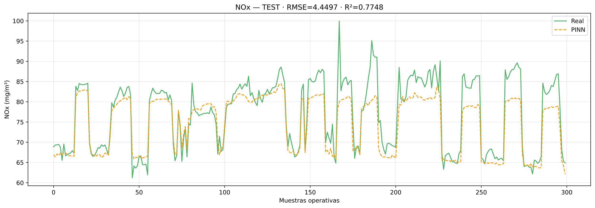
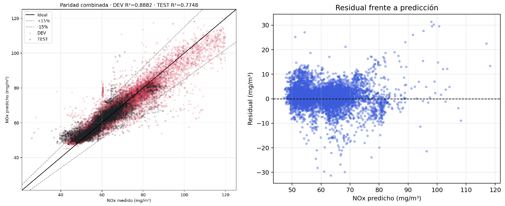
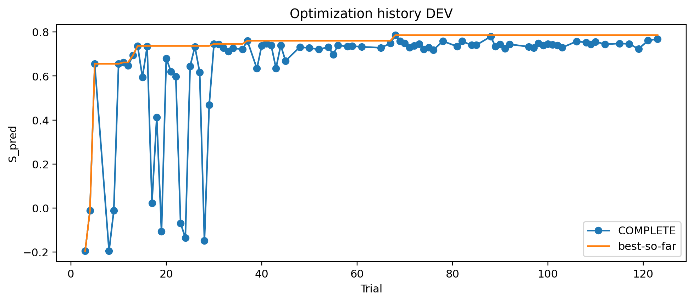

# PEMS–PINN: prueba de concepto algorítmica

Repositorio de investigación que reúne la evidencia computacional del Capítulo
10 y de los Apéndices A y B del trabajo de maestría de Rivera (2026),
*Metodología Conceptual para la Implementación de Sistemas de Monitoreo Predictivo de Emisiones (PEMS) Basados en Redes Neuronales Informadas por la Física (PINNs) Aplicado a Fuentes Fijas de Combustión en el Sector Petróleo y Gas Colombiano*. Compara PINN densa, TT-PINN y XGBoost para estimar emisiones de CO y
NOx de una turbina de gas bajo evaluación interpolativa y validación temporal
*walk-forward*.

## Resultados visuales destacados

Las siguientes gráficas presentan una muestra representativa de la evaluación
predictiva y del proceso de optimización para NOx.

<p align="center">
  <a href="assets/image1.png">
    
  </a>
</p>

<p align="center">
  <em>Figura 1. Comparación entre la serie de referencia y la predicción PINN de NOx en el conjunto de prueba.</em>
</p>

<p align="center">
  <a href="assets/image2.png">
    
  </a>
</p>

<p align="center">
  <em>Figura 2. Paridad entre valores medidos y predichos de NOx, acompañada del análisis de residuos.</em>
</p>

<p align="center">
  <a href="assets/image3.png">
    
  </a>
</p>

<p align="center">
  <em>Figura 3. Evolución del desempeño durante la optimización de hiperparámetros.</em>
</p>

## Contenido verificable

- Los cinco CSV originales de UCI (`gt_2011.csv`–`gt_2015.csv`), con 36.733
  observaciones.
- Veinticuatro notebooks canónicos ejecutados: 592 celdas de código con
  contador de ejecución, 1.445 objetos de salida visibles y ninguna salida de
  error. Veintidós notebooks sustentan directamente el trabajo de maestría y
  dos documentan comparaciones complementarias.
- Configuraciones, contratos, auditorías y tablas congeladas de las campañas
  seleccionadas.
- Cuarenta y seis pesos de modelo distribuidos y cuarenta archivos de
  metadatos: ensambles compactos completos y representantes XGBoost–NOx
  catalogados.
- Figuras y datos de origen asociados al Capítulo 10.
- Inventarios técnicos y manifiestos de trazabilidad con SHA-256.

Los respaldos operativos, checkpoints intermedios, bases Optuna, monitores,
ejecuciones fallidas, duplicados exactos y el documento académico no forman
parte de la distribución.

## Resultados principales

Los valores interpolativos corresponden al modelo y la semilla representativa
congelados. Los resultados *walk-forward* corresponden al ensamble multisemilla
evaluado sobre 2015.

| Protocolo | Modelo | Objetivo | R² | RMSE | MAE | PCD (%) |
|---|---|---:|---:|---:|---:|---:|
| Interpolativo | PINN densa | CO | 0.5317 | 1.1370 | 0.5934 | 99.12 |
| Interpolativo | TT-PINN | CO | 0.5222 | 1.1484 | 0.6001 | 97.71 |
| Interpolativo | XGBoost | CO | 0.5081 | 1.1653 | 0.6031 | — |
| Interpolativo | PINN densa | NOx | 0.7748 | 4.4497 | 3.0346 | 100.00 |
| Interpolativo | TT-PINN | NOx | 0.7686 | 4.5106 | 3.0611 | 100.00 |
| Interpolativo | XGBoost | NOx | 0.7449 | 4.7358 | 3.1831 | — |
| *Walk-forward* | PINN densa | CO | 0.4764 | 1.6171 | 1.0933 | 99.95 |
| *Walk-forward* | XGBoost | CO | 0.5258 | 1.5390 | 0.9456 | — |
| *Walk-forward* | PINN densa | NOx | 0.2611 | 9.5685 | 7.3863 | 99.01 |
| *Walk-forward* | XGBoost | NOx | 0.1275 | 10.3977 | 8.4938 | — |

`PCD` es el porcentaje de consistencia direccional respecto de la restricción
física del modelo; no representa un límite normativo de emisiones. Las
definiciones están en [methodology.md](docs/methodology.md) y la correspondencia
con el trabajo académico en [book_evidence_map.md](docs/book_evidence_map.md).

## Inicio rápido

Requisitos: Git, Git LFS y Python 3.12. Después de clonar o descargar el
repositorio:

```bash
cd pems-pinn-algorithmic-poc
git lfs install
python -m venv .venv
```

En PowerShell:

```powershell
.venv\Scripts\Activate.ps1
python -m pip install --upgrade pip
python -m pip install -r requirements.txt
python scripts/verify_release.py
```

En Linux/macOS, active el entorno con `source .venv/bin/activate`. También puede
usarse `conda env create -f environment.yml`.

Los notebooks de `notebooks/` conservan contadores, tablas, gráficos y
resultados ejecutados. `reports/executed/v1.0.0/` ofrece un espejo inmutable de
esa evidencia. Las referencias históricas de ruta que permanecen dentro de las
ejecuciones se documentan en `manifests/portability_findings.csv`; no forman
parte de la interfaz pública del repositorio.

## Mapa del repositorio

```text
data/raw/                 datos originales y checksums
notebooks/                notebooks canónicos ejecutados con resultados visibles
reports/executed/         espejo versionado de la evidencia ejecutada
configs/                  configuraciones y contratos congelados
results/frozen/           métricas, predicciones, figuras, reportes y auditorías
figures/                  figuras académicas y material suplementario
models/                   pesos distribuidos y metadatos de modelos
manifests/                inventario, linaje, migración e integridad
docs/                     método, reproducibilidad, inventarios y limitaciones
references/               bibliografía formal y archivo BibTeX
scripts/                  verificaciones que no reentrenan modelos
```

## Versiones canónicas de las campañas

| Familia / protocolo | CO | NOx |
|---|---|---|
| Protocolo interpolativo | R1 | R1 |
| PINN densa, optimización interpolativa | R5 | R6 |
| PINN densa, final interpolativa | R5F_STD | R6F_STD |
| TT-PINN, final interpolativa | R1F_STD | R1F_STD |
| XGBoost, optimización/final interpolativa | R1 / R1F_STD | R1 / R1F_STD |
| Protocolo *walk-forward* | R1 | R1 |
| PINN densa, optimización/final *walk-forward* | R3 / R3F_STD | R3 / R3F_STD |
| XGBoost, optimización/final *walk-forward* | R1 / R1F_STD | R1 / R1F_STD |

Estos identificadores forman parte del linaje científico. El experimento
XGBoost `R2F_BUDGET_MATCHED` se conserva como análisis poshoc: fue congelado
contra generaciones Dense anteriores (CO R4 y NOx R5) y no sustituye los
resultados R1F_STD usados en el Capítulo 10.

## Integridad y archivos grandes

Ejecute `python scripts/verify_release.py` para comprobar integridad. El modelo
XGBoost–NOx representativo ocupa 133.653.329 bytes, por encima del límite de
100 MiB de GitHub; `.gitattributes` asigna `.ubj` y `.pt` a Git LFS.

Los pesos PyTorch y modelos XGBoost deben tratarse como datos no confiables si
se obtienen fuera de esta distribución. Verifique sus SHA-256 y consulte
[SECURITY.md](SECURITY.md) antes de cargarlos.

## Datos, cita y derechos

Los CSV proceden de UCI Machine Learning Repository, conjunto *Gas Turbine CO
and NOx Emission Data Set*, DOI `10.24432/C5WC95`, distribuido bajo CC BY 4.0.
La atribución completa está en [data/README.md](data/README.md).

El código, los notebooks, modelos, figuras y documentación originales están
protegidos por el aviso de derechos de [LICENSE](LICENSE). Los datos y demás
materiales de terceros conservan sus licencias propias.

Para citar el software use [CITATION.cff](CITATION.cff). La referencia completa
del trabajo de maestría y las once fuentes bibliográficas asociadas están en
[BIBLIOGRAPHY.md](references/BIBLIOGRAPHY.md) y
[references.bib](references/references.bib).

## Documentación

- [Inventario técnico y criterios de curaduría](docs/inventory_report.md)
- [Metodología](docs/methodology.md)
- [Reproducibilidad](docs/reproducibility.md)
- [Inventario de modelos](docs/model_inventory.md)
- [Mapa de evidencia académica](docs/book_evidence_map.md)
- [Procedencia de los datos](docs/data_provenance.md)
- [Dependencias y linaje](docs/dependency_graph.md)
- [Alcance de la publicación](docs/publication_scope.md)
- [Limitaciones](docs/limitations.md)
