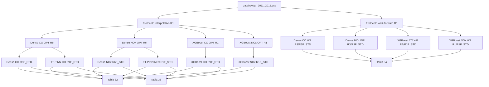

# Dependencias y linaje de artefactos

## Grafo principal

## Contratos de dependencia

- El protocolo es inmutable aguas arriba de toda búsqueda de hiperparámetros.
- La optimización no puede abrir TEST y debe congelar configuración/política
  antes del notebook final.
- El notebook final verifica hashes de sus entradas, entrena semillas
  predeclaradas y abre TEST una vez.
- TT-PINN consume la configuración Dense seleccionada para aislar el efecto de
  compresión; no realiza una búsqueda oportunista independiente.
- Los resúmenes y figuras son consumidores, nunca fuentes autoritativas de
  métricas.

## Dependencias de software

| Área | Dependencias directas |
|---|---|
| Datos y métricas | NumPy, pandas, SciPy, scikit-learn |
| PINN Dense/TT | PyTorch, matplotlib, psutil |
| Optimización | Optuna, joblib |
| Línea base | XGBoost |
| Notebooks | Jupyter/IPython, nbconvert |
| Colab histórico | `google.colab` opcional, no requerido por el repositorio |

El addendum computacional TT-PINN tiene una dependencia heredada en
`tools.tt_pinn_computational_benchmark_r1`. Sus resultados se preservan como evidencia, pero esa ejecución no constituye
una receta portable desde la distribución pública.
